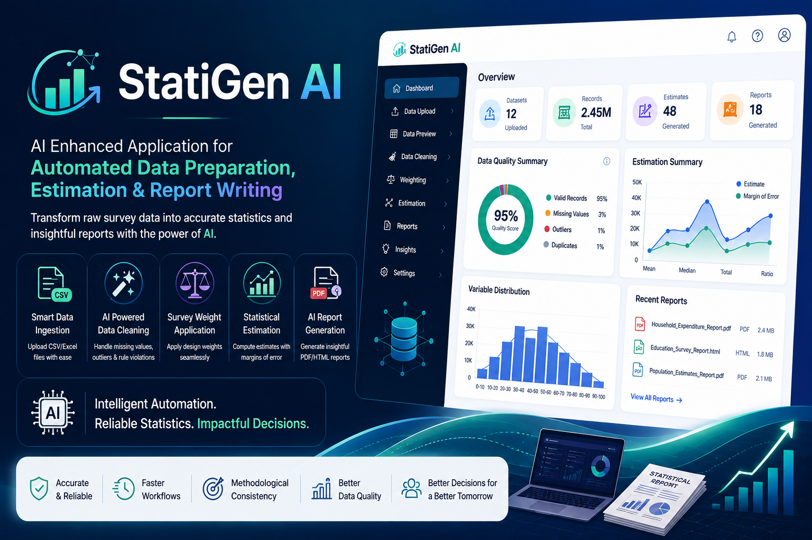

# 📊 StatiGen AI

> AI-Enhanced Application for Automated Data Preparation, Estimation, and Report Writing



## 🚀 Overview

**StatiGen AI** is an AI-powered platform designed to automate the complete survey data processing workflow. It enables users to upload raw survey datasets, perform intelligent data cleaning, apply survey weights, generate statistical estimates, and create publication-ready reports with minimal manual effort.

The platform leverages Artificial Intelligence and statistical methods to improve data quality, ensure methodological consistency, and accelerate report generation for researchers, government organizations, and statistical agencies.

---

## ✨ Features

### 📂 Smart Data Upload
- Upload CSV and Excel datasets
- Automatic schema detection
- Dataset preview
- Column mapping

### 🧹 AI Data Cleaning
- Missing value imputation
- Duplicate detection
- Outlier detection (IQR, Z-Score)
- Data type validation
- Rule-based consistency checks

### ⚖ Survey Weight Application
- Apply design weights
- Weighted & unweighted summaries
- Sampling weight management

### 📈 Statistical Estimation
- Mean
- Median
- Variance
- Standard Error
- Confidence Interval
- Margin of Error

### 🤖 AI Insights
- Automatic data quality analysis
- AI-generated observations
- Trend detection
- Natural language explanations

### 📄 Automated Report Generation
- PDF Reports
- HTML Reports
- Charts & Visualizations
- Executive Summary
- Statistical Tables

### 📊 Interactive Dashboard
- Dataset Overview
- Quality Score
- Statistical Charts
- Report History

---

# 🏗 System Architecture

```
                CSV / Excel Upload
                        │
                        ▼
          AI Schema Detection Engine
                        │
                        ▼
            AI Data Cleaning Module
                        │
                        ▼
          Survey Weight Calculation
                        │
                        ▼
          Statistical Estimation Engine
                        │
                        ▼
           AI Insight Generation
                        │
                        ▼
       PDF / HTML Report Generation
                        │
                        ▼
                Interactive Dashboard
```

---

# 🛠 Tech Stack

## Frontend

- React.js
- TypeScript
- Tailwind CSS
- Material UI
- Recharts

## Backend

- FastAPI
- Python

## AI

- Google Gemini API
- LangChain
- PandasAI

## Machine Learning

- Scikit-Learn
- NumPy
- Pandas

## Statistics

- SciPy
- Statsmodels

## Database

- PostgreSQL

## Storage

- MinIO / AWS S3

## Report Generation

- ReportLab
- WeasyPrint
- Jinja2

---

# 📁 Project Structure

```
StatiGen-AI
│
├── frontend
│   ├── src
│   ├── components
│   ├── pages
│   └── assets
│
├── backend
│   ├── api
│   ├── models
│   ├── services
│   ├── statistics
│   ├── ai
│   └── utils
│
├── datasets
│
├── reports
│
├── docs
│
├── requirements.txt
│
└── README.md
```

---

# ⚙ Installation

## Clone Repository

```bash
git clone https://github.com/yourusername/StatiGen-AI.git
```

```bash
cd StatiGen-AI
```

---

## Backend

```bash
cd backend

python -m venv venv
```

Windows

```bash
venv\Scripts\activate
```

Linux / macOS

```bash
source venv/bin/activate
```

Install dependencies

```bash
pip install -r requirements.txt
```

Run Backend

```bash
uvicorn main:app --reload
```

---

## Frontend

```bash
cd frontend

npm install

npm run dev
```

---

# 📊 Workflow

1. Upload CSV/Excel Dataset

2. AI Detects Dataset Schema

3. Clean Missing Values

4. Detect Outliers

5. Validate Rules

6. Apply Survey Weights

7. Generate Statistical Estimates

8. AI Generates Insights

9. Export PDF / HTML Reports

---

# 📈 Future Enhancements

- AI Chat Assistant
- Auto Survey Questionnaire Validation
- GIS Mapping
- Multi-language Reports
- Real-time Collaboration
- Role-based Access Control
- Dashboard Analytics
- API Integration
- Cloud Deployment
- Audit Logs

---

# 🎯 Use Cases

- Government Survey Analysis
- Census Data Processing
- Academic Research
- Healthcare Surveys
- Education Analytics
- Social Science Research
- Market Research
- Public Policy Evaluation

---

# 🤝 Contributing

Contributions are welcome!

1. Fork the repository

2. Create a new feature branch

```bash
git checkout -b feature-name
```

3. Commit changes

```bash
git commit -m "Add new feature"
```

4. Push

```bash
git push origin feature-name
```

5. Open a Pull Request

---

# 📜 License

This project is licensed under the MIT License.

---

# 👨‍💻 Author

**Ayush Kumar**

B.Tech Information Technology

Guru Ghasidas Vishwavidyalaya, Bilaspur

---

## ⭐ If you like this project, don't forget to star the repository!